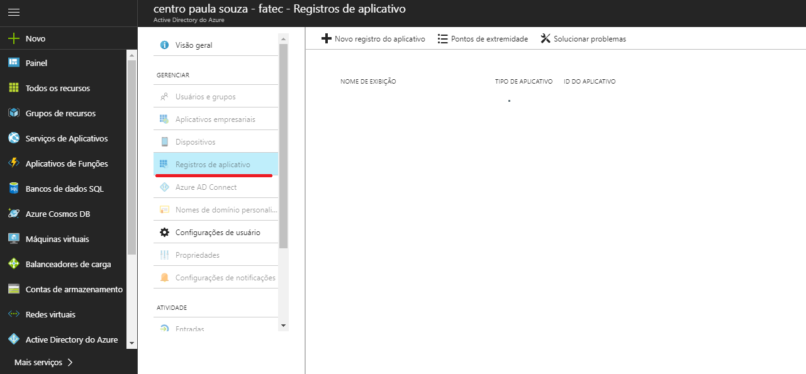
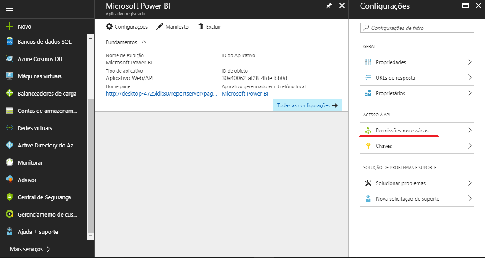

<div align="center">
<h1 align="center">Power BI - Filtragem</h1>
</div>
<div align="center">
  Filtragem de relatórios utilizando a <a href="https://github.com/Microsoft/PowerBI-JavaScript">api</a> javascript do powerbi usando um exemplo de aplicação em c#.
</div>

<br />

<div align="center">
  <h3>
    <a href="https://github.com/Microsoft/PowerBI-JavaScript">
      PowerBI - Javascript
    </a>
    <span> | </span>
    <a href="https://github.com/Microsoft/PowerBI-Developer-Samples">
      PowerBI - Developer Samples
    </a>
    <span> | </span>
    <a href="https://microsoft.github.io/PowerBI-JavaScript/demo/v2-demo/index.html#">
      Exemplos de interações com relatórios
    </a>
  </h3>
</div>

  - [Instalação](#instala%C3%A7%C3%A3o)
    - [1. Registrar aplicativo no Azure](#1-registrar-aplicativo-no-azure)
    - [2. Aplicação demo no visual studio](#2-aplica%C3%A7%C3%A3o-demo-no-visual-studio)
  - [Exemplo de filtro na aplicação](#exemplo-de-filtro-na-aplica%C3%A7%C3%A3o)
  - [Erros Comuns](#erros-comuns)

## Instalação

Para utilizar a api é necessário baixar a [aplicação demo](https://github.com/Microsoft/PowerBI-Developer-Samples), registrar um aplicativo usando o [portal de dev do PowerBI](https://dev.powerbi.com/apps), autorizar o aplicativo no [Active Directory do Azure](https://portal.azure.com/#blade/Microsoft_AAD_IAM/ActiveDirectoryMenuBlade), alterar os dados na webconfig do app.

Para realizar as filtragens é alterando o objeto criado  por javascript.

### 1. Registrar aplicativo no Azure

Para utilizar a api é necessário registrar o app no [portal de dev do PowerBI](https://dev.powerbi.com/apps) como native app. É importante depois de registrar o aplicativo, entrar no portal do azure, procurar [Active Directory do Azure](https://portal.azure.com/#blade/Microsoft_AAD_IAM/ActiveDirectoryMenuBlade) e realizar os seguintes passos:

- Clicar em registro de apps



- Clicar em Permissões Necessárias



- Clicar em conceder permissões


### 2. Aplicação demo no visual studio

Baixar a pasta e entrar na pasta **App Owns Data** e abrir o projeto pelo Visual Studio. Altere os dados no arquivo **Web.config**.


* clientId - Id da aplicação do Azure, criada pelo [portal de dev do PowerBI](https://dev.powerbi.com/apps).

* groupId - ID do grupo ou dashboard que você deseja implementar.

* reportId - ID do relatório que você deseja implementar.


* pbiUsername - Admin do grupo escolhido (email)

* pbiPassword - senha do usuário escolhido

Depois é só rodar o projeto (f5), e clicar em report. O relatório deve aparecer.

## Exemplo de filtro na aplicação

Para filtrar é usado um setFilter no relatório, seguindo o relatório da aplicação demo ficaria:

```js
report.setFilters([{
      $schema: "http://powerbi.com/product/schema#advanced",
      target: {
        table: "Date",
        column: "Month"
      },
      operator: "In",
      values: ["March"]
    }]).then(function (result) {
      console.log("Filtrado com sucesso!");
    })
    .catch(function (er) {
      console.warn(er);
    });
```

## Funções JS

**Colocar filtro**: report.setFilters([{}])

```js
// Os filtros podem ser básicos ou avançados com condições
report.setFilters([{
      $schema: "http://powerbi.com/product/schema#advanced",
      target: {
        table: "Date",
        column: "Month"
      },
      operator: "In",
      values: ["March"]
    }])
```

**Retornar filtros**: report.getFilters()
```js
report.getFilters()
    .then(function (filters) {
        console.log(filters);
    })
```

**Mudar página:** report.setPage("ReportSection2") - Nome da página mesmo, não o de visualização

**Remover página:** report.removeFilters()

**Retornar páginas:** 

```js

report.getPages()
    .then(function (pages) {
        pages.forEach(function(page) {
            var log = page.name + " - " + page.displayName;
            console.log(log);
        });
    })

```

**Imprimir relatório:** report.print()

**Entrar em fullscreen:** report.fullscreen()

[Documentação](https://microsoft.github.io/PowerBI-JavaScript)

[Funções](https://microsoft.github.io/PowerBI-JavaScript/demo/v2-demo/index.html#)

## Erros Comuns

- Erro de autorização 401: Você nao possui permissão para acessar o relatório. Confirmar se o usuário é administrador do grupo ou se o numero do relatório está correto

- Erro de autorização ao gerar token: As permissões concedidas ao aplicativo não estão certas. Conferir se você criou um native app no azure e se você concedeu as permissões.